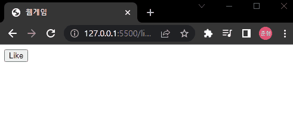

# 01. 구구단

# 01-01. 리액트를 왜 쓰는가

React 18버전 code로 진행

17과 큰차이는 없으니 걱정 No!


Vue와 React, Angular, ...등 모두 **Single Page Application**

외관상으로 보면, 흔히 보던 웹 페이지들은 각 페이지들이 명확하게 나뉘어져 있다.

SPA는 웹 사이트가 아니라 모바일 앱같은 느낌이 나는 사이트들이 Web Application이다.

데이터를 바꾸면 화면도 바뀐다.

복잡한 웹앱에서 데이터와 화면 일치 문제를 쉽게 해결해주기 때문에 사용!


굳이 모든 웹 사이트를 SPA로 만들 필요는 없다.

=> 검색엔진 노출에 어려움이 있을 수 있다.

※  그리고 기본기를 소홀히 하지말자!


### SOURCECODE 

react18 branch

[react-webgame](https://github.com/Zerocho/react-webgame/tree/react18)


다른 강좌를 봤을 때 `create-react-app`을 이용하는 것이 많지만, 해당 강좌에서는 html부터  원시적인 형태부터 시작할 것이다.


## 01-03. 첫 리액트 컴포넌트(아직은 Class)

아래 코드를 먼저 복사하여 기본 구조를 살펴보자.

```html
// like-button.html
<html>
<head>
    <meta charset="utf-8">
    <title>웹게임</title>
</head>
<body>
<div id="root"></div>
<script crossorigin src="https://unpkg.com/react@18/umd/react.development.js"></script>
<script crossorigin src="https://unpkg.com/react-dom@18/umd/react-dom.development.js"></script>
<!--<script src="https://unpkg.com/react@18/umd/react.production.min.js" crossorigin></script>-->
<!--<script src="https://unpkg.com/react-dom@18/umd/react-dom.production.min.js" crossorigin></script>-->
<script>
  'use strict';

  const e = React.createElement;

  class LikeButton extends React.Component {
    constructor(props) {
      super(props);
      this.state = {liked: false};
    }

    render() {
      if (this.state.liked) {
        return 'You liked this.';
      }

      return e('button', {onClick: () => this.setState({liked: true})}, 'Like');
    }
  }
</script>
<script>
  ReactDOM.createRoot(document.querySelector('#root')).render(e(LikeButton));
</script>
</body>
</html>
```

❗ 리액트라고 특별한게 아니고, 결국 javascript이다.


코드를 살펴보자.

```javascript
<script crossorigin src="https://unpkg.com/react@18/umd/react.development.js"></script>
<script crossorigin src="https://unpkg.com/react-dom@18/umd/react-dom.development.js"></script>
```

해당 script를 불러옴으로써  React와 ReactDOM을 사용할 수 있게 된다.

❗ 만약 실무에서는 주석처리된 스크립트(배포용)를 사용해야 하지만,  실제론 webpack, vite, ...이런걸로 처리를 할 거라 거의 사용할 일 없다. 


react에서는 크게 두 가지 방식이 있다.

* 클래스를 이용하는 방식.
* 함수를 이용하는 방식.

```javascript
class LikeButton extends React.Component{ }

const LikeButton = () => {};
function LikeButton() {}
```

class를 이용하는 방식은 지금 거의 안 쓰인다.

(**ErrorBoundary말고는 잘 안쓰인다.** 하지만 옛날코드의 경우 남아있을 수 있으니 알고는 있어아 햔다.)


> ❗ 명심하자
>
> 리액트는 자바스크립트다.
>
> 리액트는 데이터 중심으로 움직인다.


위에서 만든 LikeButton이란 컴포넌트로 살펴보자.

(컴포넌트는 데이터와 화면을 하나로 묶어둔 덩어리)

```javascript
class LikeButton extends React.Component {
        constructor(props) {
          super(props);
          this.state = { liked: false };
        }

        render() {
          if (this.state.liked) {
            return "You liked this.";
          }

          return React.createElement("button", { onClick: () => this.setState({ liked: true }) }, "Like");
        }
      }
```

그럼 여기서 데이터는? => state

화면은? => render()의 return 부분.

리액트가 해결하고자하는 것이 데이터와 화면의 일치 였다.

즉 state가 바뀌면, 화면이 알아서 바뀐다.


실행해보면 브라우저에 아무것도 안뜰 것인데, 왜냐면 컴포넌트를 만들었지만, 컴포넌트를 화면에 그리지는 않았기 때문.

```javascript
<script>
    ReactDOM.createRoot(document.querySelector("#root")).render(
    e(LikeButton)
);
</script>
```

LikeButton 컴포넌트를 id가 root에 넣는 다는 뜻이다.




## 01-04. 가독성을 위한 JSX (XML임!)

위처럼 js로만 작성하면, 가독성이 너무 좋지 않다.

그래서 등장한 것이 **JSX (Javascript + XML)**

```javascript
// return React.createElement("button", { onClick: () => this.setState({ liked: true }) }, "Like");
return {
    <button onClick={()=>this.setState({liked: true})}>
        Like
</button>
}
<script>
    ReactDOM.render(<LikeButton/>, document.querySelector("#root"));
</script>
```

실제로는 돌아가지 않는다. script에 button tag같은부분이 불가능함.

그래서 필요한 것이 **babel**.

babel이 저런 jsx문법을 보면, 바꿔준다.

❗ 원래는 안돌아 가는 코드를 Babel을 이용하여, 돌아가게끔 해준다.


어떻게 쓸까?

script를 추가해주고, script의 type을 `text/babel`로 변경해준다.


### React18에서 바뀐점

17버전에서는 `ReactDOM.render is no llonger supported in React18. ...`란 부분이 console에 보인다.

18버전에서 17도 같이 동작하게끔 해놔서 실행에 문제는 없다. 

하지만 18버전의 기능이 제대로 동작 하지 않을 것이다.

```javascript
// React 17
ReactDOM.render(<LikeButton/>, document.querySelector("#root"));
```

위에서 작성한 코드가 17버전의 코드이다.

18버전에서는 아래처럼 바뀌게 된다.

```javascript
// React 18
ReactDOM.createRoot(document.querySelector("#root")).render(<LikeButton />);
```

**❗ render -> createRoot로 변경**

17과 18버전의 render구별 잘하기!


>  ❗ 주의 
>
> 만든 컴포넌트는 이름이 반드시 대문자. html 태그들은 소문자.
>
> input 태그의 경우 닫는 태그 꼭 붙여주어야 한다.
>
> javascript code 부분은 중괄호로 감싸 주어야 한다. 
>
> 변수의 경우 `<button> { 변수 } </button> ` 형태
>
> 객체의 경우 `<button onClick={()=> { obj={{a:'b', c:'d'}} }> 버튼 </button>`
>
> if문의 경우 3항연산자, for문의 경우 map을 자주 사용한다.
>
> <br/>return 태그는 형제 태그가 불가능하다.
>
> 꼭 부모태그를 감싸주어야 한다.
>
> Fragment 태그라고 있는데 나중에 배울 것이다.
>
> 여러 줄이 되면 소괄호로 묶어 준다.
>
> `return (<button> 버튼 </button>) `
>
> <br/>


## 01-05. 클래스 컴포넌트의 형태와 리액트 데브툴즈

(위에서 클래스 문법을 보여준 것은 과거 코드가 그렇게 작업된게 있을 수 있으니 읽을 줄은 알아야 하기 때문)

화면을 그리는 부분은  render의 return안에 모두 작성되있다.

html이지만, javascript가 컨트롤하는 셈.

```javascript
class LikeButton extends React.Component {
    constructor(props) {
        super(props);
        this.state = { liked: false };
    }

    render() {
        if (this.state.liked) {
            return "You liked this.";
        }

        return (
            <button onClick={() => this.setState({ liked: true })}>Like</button>
		);
	}
}
```

아래처럼 생각해 볼 수 있다.

```javascript
<button onClick={() => {this.state.liked=true;}}>Like</button>
```

이 경우 React에서는 불가능하다.


**❗ 명심하자. 객체를 함부로 바꾸지 마라. (불변성)**

무슨 말일까? 

splice, pop, push, ... 같은 객체를 직접 바꾸는 함수들을 사용 x.

객체를 바꿀수 있는 방법으로 setState가 있다.

```javascript
// this.state.liked = true;
<button onClick={() => this.setState({ liked: true })}>Like</button>
```


Vue Devtools처럼 React도 DevTools가 존재한다.

[React Devtools 설치](https://chrome.google.com/webstore/detail/react-developer-tools/fmkadmapgofadopljbjfkapdkoienihi?hl=ko)


코드들을 보면 아래처럼 따로 빼서 사용하는 경우가 있을 수 있다.

```javascript
class LikeButton extends React.Component{
    onClickButton(){
        this.setState({liked:true});
    }

    render(){
        ...
        return(
            <button onClick={this.onClickButton}> Like </button>
        )
    }
}
```

이런 경우 동작을 안한다. 

그때 **constructor에 bind**를 꼭 해주어야지 밖으로 빼서 사용할 수 있었다.

```javascript
class LikeButton extends React.Component{
    constructor(props) {
        super(props);
        this.state = { liked: false };
        this.onClickButton = this.onClickButton.bind(this)
    }
    
    onClickButton(){
        this.setState({liked:true});
    }

    render(){
        ...
        return(
            <button onClick={this.onClickButton}> Like </button>
        )
    }
}
```

또는 **화살표 함수를 사용해서 사용**할 수 있다.


## 01-06. 함수 컴포넌트(함수형 아님)

class에서 this문제가 있어 잘 사용하지 않게 될 것이다.

function으로 가보자.

```javascript
function LikeButton(){ // 함수형 컴포넌트 X. 함수 컴포넌트 O
    const [liked, setLiked] = React.useState(false)
    if(liked){
        return 'You liked this.'
    }
    return (
    	<button onClick={()=>{setLiked(true)}}>Like </button>
    )
}
```

여기서 주의 할 점은 함수형 컴포넌트가 아니라 **함수 컴포넌트**라는 점.

이렇게 되면 class로 작성한 것 과는 또 다른 라이브러리가 된다.

❗ 리액트 자체는 라이브러리지만, 리액트 생태계를 통틀어서 프레임워크라고 진행.

useState는 this.state와 비슷한 뜻.

**render라는 함수가 따로 없어 return한게 화면이 된다.**


## 01-07. 구구단 리액트로 만들기

문제가 주어지고, 답을 입력해 맞는지 틀린지 확인하는 구구단을 만들 것이다.

여기서 state에 해당하는 부분을 생각해보자.

state는 바뀌는 것들. 즉, 아래 3가지가 state에 해당한다고 볼 수 있다.

* 맞추고나서 바뀌는 문제.
* 입력하는 입력 값
* 맞는지 틀린지 출력하는 출력문.

```html
<div id="root"></div>
<script type="text/babel">
	class GuGuDan extends React.Component {
        constructor(props){
            super(props)
        }
        render(){
            return;
        }
    }
</script>
<script type="text/babel">
	ReactDOM.render(<GuGuDan/>, document.querySelector("#root"));
</script>
```

이제 바뀌는 부분인 state를 채워보자.

```javascript
<script type="text/babel">
	class GuGuDan extends React.Component {
        constructor(props){
            super(props)
            this.state = {
            	first: Math.ceil(Math.random() * 9)  , // 첫번 쨰 숫자
                second: Math.ceil(Math.random() * 9)  , // 두번 째 숫자
                value: '', // 입력
                result: '', // 결과
            };
        }
        render(){
            return;
        }
    }
</script>
```


render에 태그를 넣어 주자.

(사람마다 스타일 차이긴 한데 return에 괄호를 감싸서 작성하는 사람과 아닌 사람이 있으니 크게 신경 쓰지말자.)

```javascript
 render(){
     return (
         <div>
         	<div>{this.state.fisrt} 곱하기 {this.state.second}는?</div>
		 <form>
         	<input type="number" value={this.state.value}/>
         	<button>입력!!</button>
         </form>
         <div>{this.state.result}</div>
         </div>
     );
}
```

**중괄호**를 쓰면 그 안에는 javascript를 쓸 수 있다.

input은 단일 태그라서, 닫는 태그를 안쓰면, 에러발생! XML인 점을 볼 수 있다.


실행시켜보면 입력이 안된다.

input이 `this.state.value`가 설정 되있기 때문.

change 이벤트로 state의 값을 바꿔주자.

```javascript
...
<form>
    <input type="number" value={this.state.value} onChnage={(e)=>this.setState({value: e.target.value})}/>
	<button>입력!!</button>
</form>
...
```


## 01-08. 클래스 메서드

입력 누르면 form을 제출해주어야한다.

제출 후 값을 체크하는 로직을 onSubmit에 작성.

```javascript
...
<form onSubmit={(e)=>{
                e.preventDefault();
                // 구구단 로직
                if(parseInt(value) === this.state.first * this.state.second){
                  this.setState({
                    result: '정답',
                    first: Math.ceil(Math.random()*9),
                    second: Math.ceil(Math.random()*9),
                    value:'',
                  })
                } else{
                  this.setState({
                    result: '땡',
                    value: '',
                  })
                }
              }}>
...
```

하지만 이렇게 작성하는 것 보다 class에 메서드로 만들어서 관리하자.

```javascript
<script type="text/babel">
      class GuGuDan extends React.Component {
        constructor(props) {
          super(props);
          this.state = {
            first: Math.ceil(Math.random() * 9), // 첫번 쨰 숫자
            second: Math.ceil(Math.random() * 9), // 두번 째 숫자
            value: "", // 입력
            result: "", // 결과
          };
        }

        onChange = (e)=>{
          this.setState({value: e.target.value})
        }
        onSubmit = (e) =>{
          e.preventDefault();
                // 구구단 로직
                if(parseInt(value) === this.state.first * this.state.second){
                  this.setState({
                    result: '정답',
                    first: Math.ceil(Math.random()*9),
                    second: Math.ceil(Math.random()*9),
                    value:'',
                  })
                } else{
                  this.setState({
                    result: '땡',
                    value: '',
                  })
                }
        }
        render() {
          return (
            <div>
              <div>
                {this.state.fisrt} 곱하기 {this.state.second}는?
              </div>
              <form onSubmit={this.onSubmit}>
                <input type="number" value={this.state.value} onChange={this.onChange}/>
                <button>입력!!</button>
              </form>
              <div>{this.state.result}</div>
            </div>
          );
        }
      }
    </script>
```


## 01-09. Fragment와 기타 팁들

render부분에 div로 감쌀 필요가없는데 감싸져 있는 부분을 볼 수 있다.

지금은 개선이 되서 빈 태그로 감쌀 수 있다.

(현재 바벨에서는 빈 태그를 지원하지 않아 **React.fragment**를 작성)

```javascript
...
render() {
    return (
      <React.Fragment>
        <div>{this.state.fisrt} 곱하기 {this.state.second}는?</div>
		<form onSubmit={this.onSubmit}>
            <input type="number" value={this.state.value} onChange={this.onChange}/>
            <button>입력!!</button>
		</form>
		<div>{this.state.result}</div>
	  </React.Fragment>
);
}
...
```


> ❗ 주의
>
> 함수 따로 빼서 쓸 때는 무조건 화살표 함수 사용.
>
> function을 붙이게 되면 this가 달라져 버린다.
>
> render는 그냥 사용 가능.
>
> 실무에서 constructor안쓰고 바로 state객체를 쓰는 방식이 많이 사용된다.
>
> ```javascript
> class GuGuDan extends React.Component {
>         state = {
>           first: Math.ceil(Math.random() * 9), // 첫번 쨰 숫자
>           second: Math.ceil(Math.random() * 9), // 두번 째 숫자
>           value: "", // 입력
>           result: "", // 결과
>         };
> 
>         onChange = (e) => {
>           this.setState({ value: e.target.value });
>         };
>         onSubmit = (e) => {
>           e.preventDefault();
>           // 구구단 로직
>           if (
>             parseInt(this.state.value) ===
>             this.state.first * this.state.second
>           ) {
>             this.setState({
>               result: `${this.state.value} 정답!`,
>               first: Math.ceil(Math.random() * 9),
>               second: Math.ceil(Math.random() * 9),
>               value: "",
>             });
>           } else {
>             this.setState({
>               result: "땡",
>               value: "",
>             });
>           }
>         };
>         render() {
>           return (
>             <React.Fragment>
>               <div>
>                 {this.state.first} 곱하기 {this.state.second}는?
>               </div>
>               <form onSubmit={this.onSubmit}>
>                 <input
>                   type="number"
>                   value={this.state.value}
>                   onChange={this.onChange}
>                 />
>                 <button>입력!!</button>
>               </form>
>               <div>{this.state.result}</div>
>             </React.Fragment>
>           );
>         }
>       }
> ```


## 01-10.  함수형 setState

위에서 정답 앞에 정답 값을 추가하게 작성하였었는데, 이게 미래 값을 set하는 건데 현재값이 섞여 있어 햇갈릴 수 있다.

이런 것을 위해 setState안에다 함수를 넣고 거기서 prevState를 받아 리턴하는 방법이 있다.

``` javascript
 onSubmit = (e) => {
          e.preventDefault();
          // 구구단 로직
          if (parseInt(this.state.value) ===this.state.first * this.state.second) {
            this.setState((prevState) => {
              return {
                result: `${prevState.value} 정답!`,
                first: Math.ceil(Math.random() * 9),
                second: Math.ceil(Math.random() * 9),
                value: "",
              };
            });
          } else {
            this.setState({
              result: "땡",
              value: "",
            });
          }
        };
```

setState는 여러개 쓸 수 있는데, 문제는 setState가 비동기라서 문제가 발생할 수 있다.

그렇기 때문에 예전 state값으로 새로운 state값을 만들 때는 함수를 리턴해주는 방식을 써주자.


## 01-11. ref

input 입력 후에 focus를 주려면 어떡해야할까?

documnet로 접근할 수도 있지만, react가 화면을 컨트롤 할 수 있게 해주는게 좋다.

ref를 이용해보자.

```javascript
inputEl;

render() {
    return (
      <React.Fragment>
        <div>{this.state.first} 곱하기 {this.state.second}는?</div>
		<form onSubmit={this.onSubmit}>
	    <input ref={(c)=>this.inputEl = c}
		  type="number"
		  value={this.state.value}
		  onChange={this.onChange}
		/>
		<button>입력!!</button>
        </form>
        <div>{this.state.result}</div>
	  </React.Fragment>
	);
}
```

ref로 설정할 이름을 작성해두고, ref를 작성하면, 다른 곳에서도 this.이름으로 접근이 가능.