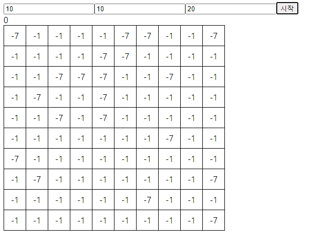

# 08. 지뢰찾기

## 08-01. Context API 소개와 지뢰찾기

td를 dispatch가 3번을 거쳐 사용할 수 있었는데,  Context API를 사용해 고쳐보자.

가로 세로입력칸이 있고, 경과시간, 결과창을 볼 수 있게 할 것이다.

```jsx
import React, { useReducer } from 'react';
import Table from './Table';

const initialState = {
  tableData:[],
  timer: 0,
  result:'',
}
const reducer=(state, action)=>{
  switch(action.type){
    default:
      return state;
  }
}
const MineSearch = () =>{
  const [state, dispatch] = useReducer(reducer, initialState);
  return(
    <>
      <Form />
      <div>{state.timer}</div>
      <Table></Table>
      <div>{state.result}</div>
    </>
  )
};

export default MineSearch;
```


Form을 작성해보자

```jsx
import React from 'react';

const Form = () =>{
  const [row, setRow] = useState(10);
  const [cell, setCell] = useState(10);
  const [mine, setMine] = useState(20);

  const onChangeRow = useCallback((e) =>{
    setRow(e.target.value)
  },[])
  const onChangeCell = useCallback((e) =>{
    setCell(e.target.value)
  },[])
  const onChangeMine = useCallback((e) =>{
    setMine(e.target.value)
  },[])

  onClickBtn = useCallback(()=>{

  },[])

  return(
    <div>
      <input type="number" placeholder="세로" value={row} onChange={onChangeRow}/>
      <input type="number" placeholder="가로" value={cell} onChange={onChangeCell}/>
      <input type="number" placeholder="지뢰" value={mine} onChange={onChangeMine}/>
      <button onClick={onClickBtn}>시작</button>
    </div>
  )
};

export default Form;
```

onClickBtn에 contextAPI가 들어갈 거다.

props로 dispatch로 넘기지 않고, contextAPI를 사용할 것이다.

contextAPI를 사용해 자식위치의 컴포넌트에서 바로 값을 가져올 수 있다.


## 08-02. createContext와 Provider

createContext로 만들 수 있다.

하위 컴포넌트중에서 data에 접근하고 싶은 컴포넌트들을 Provider로 묶어주어야한다.

```jsx
const TableContext = createContext();

...
return(
    <TableContext.Provider value={{tableData:state.tableData, dispatch}}>
      <Form />
      <div>{state.timer}</div>
      <Table></Table>
      <div>{state.result}</div>
    </TableContext.Provider>
  )
```

Form, Table아래 있는 컴포넌트들은 tableData와 dispatch에 바로 접근할 수 있게된다.

createContext안에 초기값을 넣을 수 있는데 모양만 맞추자.

(다른 곳에서 가져와 쓸 수 있도록 export 시켜준다.)

```jsx
export const TableContext = createContext({
  tableData: [],
  dispatch:()=>{},
});

```


Form에서 dispatch를 contextAPI를 이용해 가져와보자.

```jsx
import { TableContext } from './MineSearch';

const Form = () =>{
...
  // const value = useContext(TableContext);
	{{ dispatch }} = useContext(TableContext)
}
```

value.dispatch로 dispatch에 접근이 가능해진다. => 구조분해로 수정해도됨.

>  ❗ 중요
>
> contextAPI가 성능최적화가 어려움이 있다. 
>
> 기본적인 문제 중 하나가
>
> ```jsx
> return(
>     <TableContext.Provider value={{tableData:state.tableData, dispatch}}>
>       <Form />
>       <div>{state.timer}</div>
>       <Table></Table>
>       <div>{state.result}</div>
>     </TableContext.Provider>
>   )
> ```
>
> `value={{...}}` 이렇게 써버리면, MineSearch가 새로 리렌더링 될 때 마다 `{...}`  이 객체가 새로 생긴다.
>
> 객체가 새로생성되서 자식들도 새로 리랜더링 된다는 것을 의미
>
> 그래서 캐싱을 해주어야한다 => useMemo 이용
>
> ```jsx
> const value = usememo(()=>({tableData: state.tableData, dispatch}), [state.tableData]);
> return(
>     <TableContext.Provider value={value}>
>       <Form />
>       <div>{state.timer}</div>
>       <Table></Table>
>       <div>{state.result}</div>
>     </TableContext.Provider>
>   )
> ```

Form의 onClickBtn을 완성해보자.

```jsx
 onClickBtn = useCallback(()=>{
    dispatch({type: START_GAME, row, cell, mine})
  }, [row, cell, mine])
```

reducer 작성.

plantMine은 onClickBtn으로 넘긴 row, cell, mine으로 2차원 배열을 만들 함수이다.

```jsx
const reducer=(state, action)=>{
  switch(action.type){
    case START_GAME:
      return {
        ...state,
        tableData: plantMine(action.row ,action.cell, action.mine)
      }
    default:
      return state;
  }
}
```

배열에 사용할 코드

```jsx
export const CODE = {
  MINE: -7,
  NORMAL: -1,
  QUESTION: -2, // 물음표
  FLAG: -3, // 깃발
  QUESTION_MINE: -4, // 물음표인데 지뢰
  FLAG_MINE: -5, // 깃발인데 지뢰
  CLICKED_MINE: -6, // 클릭했는데 지뢰
  OPENED: 0, // 0이상이면 opened
}
```


## 08-03. useContext 사용해 지뢰칸 렌더링

plantMine을 구현.

```jsx
const plantMine = (row, cell, mine) => {
  console.log(row, cell, mine)
  const candidate = Array(row*cell).fill().map((arr,i)=>{
    return i;
  })
  const shuffle =[];
  while(candidate.length > row*cell - mine){
    const chosen = candidate.splice(Math.floor(Math.random()*candidate.length), 1)[0];
    shuffle.push(chosen);
  }
  const data = [];
  for(let i=0;i<row;i++){
    const rowData = [];
    data.push(rowData);
    for(let j=0;j<cell;j++){
      rowData.push(CODE.NORMAL);
    }
  }

  for(let k=0;k<shuffle.length;k++){ // 지뢰 심기
    const ver = Math.floor(shuffle[k]/cell);
    const hor = shuffle[k] % cell;
    data[ver][hor] = CODE.MINE;
  }

  return data;
}
```


이제 화면을 그리면 되는데, tableData를 각 셀들에서 받아서 처리하면 된다.

contextAPI를 사용해 아래에서 useContext로 접근가능.

```jsx
// Table.jsx
import React from 'react';
import Tr from './Tr';
import { TableContext } from './MineSearch';

const Table = () =>{
  const {tableData} = useContext(TableContext);
  return(
    <table>
      {Array(tableData.length).fill().map((tr, i) => <Tr key={i} />)}
    </table>
  )
};

export default Table;

// Tr.jsx
import React from 'react';
import Td from './Td';

const Tr = () =>{
  const {tableData} = useContext(TableContext);
  return(
    <tr>
      {tableData[0] && Array(tableData[0].length).fill().map((td, i) =>
        <Td key={i} />
      )}
    </tr>
  )
};

export default Tr;
```

지뢰를 그려주기 위해 Table에서 i와 Tr에서 i를 Td까지 넘겨주자.

```jsx
// Td.jsx
import React, {useContext} from 'react';
import { TableContext } from './MineSearch';

const Td = ({rowIndex, cellIndex}) =>{
  const {tableData} = useContext(TableContext);
  return(
    <td>{tableData[rowIndex][cellIndex]}</td>
  )
};

export default Td;
```




style을 입혀보자.

return 부분의 td처럼 사용해 text에 따라 스타일을 입힐 수 있다.

```jsx
import React, {useContext} from 'react';
import { TableContext } from './MineSearch';

const getTdStyle = (code) =>{
  switch (code) {
    case CODE.NORMAL: case CODE.MINE:
      return {background: '#444' ,color:'#fff'};
    case CODE.OPENED:
      return {background: '#FFF'};
    default:
      return{background: '#FFF'};
  }
}
const getTdText = (code) =>{
  switch(code){
    case CODE.NORMAL:
      return '';
    case CODE.MINE:
      return 'X';
    default:
      return;
  }
}

const Td = ({rowIndex, cellIndex}) =>{
  const {tableData} = useContext(TableContext);
  return(
    <td
    style={getTdStyle(tableData[rowIndex][cellIndex])}
    >{getTdText(tableData[rowIndex][cellIndex])}</td>
  )
};

export default Td;
```


## 08-04. 왼쪽 오른쪽 클릭 로직 작성하기

클릭했을 떄 칸을 여는 코드를 추가.

먼저, reducer에 OPEN_CELL추가

```jsx
const reducer=(state, action)=>{
  switch(action.type){
    case START_GAME:
      return {
        ...state,
        tableData: plantMine(action.row ,action.cell, action.mine)
      }
    case OPEN_CELL:
      const tableData = [...state.tableData];
      tableData[action.row] = [...state.tableData[action.row]];
      tableData[action.row][action.cell] = CODE.OPENED;
      
      return {
        ...state,
        tableData,
      }
    default:
      return state;
  }
}
```

그 후 Td에서 dispatch

```jsx
const Td = ({rowIndex, cellIndex}) =>{
  const {tableData, dispatch} = useContext(TableContext);
  const onClickTd = useCallback(()=>{
      dispatch({type:OPEN_CELL, row: rowIndex, cell:cellIndex});
  })
  return(
    <td
    style={getTdStyle(tableData[rowIndex][cellIndex])}
    onClick={onClickTd}
    >{getTdText(tableData[rowIndex][cellIndex])}</td>
  )
};
```


지뢰인 경우도 모두 바뀌니 onClicTd에서 분기처리를 해주자.

```jsx
import React, { useCallback, useContext } from "react";
import { CODE, OPEN_CELL, TableContext } from "./MineSearch";

const getTdStyle = (code) => {
  switch (code) {
    case CODE.NORMAL:
    case CODE.MINE:
      return { background: "#444", color: "#fff" };
    case CODE.OPENED:
      return { background: "#FFF" };
    case CODE.FLAG_MINE:
    case CODE.FLAG:
      return { background: "#FF0000" };
    case CODE.QUESTION_MINE:
    case CODE.QUESTION:
      return { background: "#FFFF00" };
    default:
      return { background: "#FFF" };
  }
};
const getTdText = (code) => {
  switch (code) {
    case CODE.NORMAL:
      return "";
    case CODE.MINE:
      return "X";
    case CODE.CLICKED_MINE:
      return "펑";
    case CODE.FLAG_MINE:
    case CODE.FLAG:
      return "🚩";
    case CODE.QUESTION_MINE:
    case CODE.QUESTION:
      return "❓";
    default:
      return;
  }
};

const Td = ({ rowIndex, cellIndex }) => {
  const { tableData, dispatch } = useContext(TableContext);
  const onClickTd = useCallback(() => {
    switch (tableData[rowIndex][cellIndex]) {
      case CODE.OPENED: // 이미 연칸은 효과X
      case CODE.FLAG_MINE:
      case CODE.FLAG:
      case CODE.QUESTION_MINE:
      case CODE.QUESTION:
        return;
      case CODE.NORMAL: // 보통 칸은
        dispatch({ type: OPEN_CELL, row: rowIndex, cell: cellIndex });
        return;
      case CODE.MINE:
        dispatch({ type: CLICK_MINE, row: rowIndex, cell: cellIndex });
        return;
    }
  });
  return (
    <td style={getTdStyle(tableData[rowIndex][cellIndex])} onClick={onClickTd}>
      {getTdText(tableData[rowIndex][cellIndex])}
    </td>
  );
};

export default Td;

```


onContextMenu이벤트를 통해 우클릭 처리.


## 08-05. 지뢰 개수 표시하기

## 08-06. 빈 칸들 한 번에 열기

## 08-07. 승리 조건 체크와 타이머

## 08-08. Context API 최적화