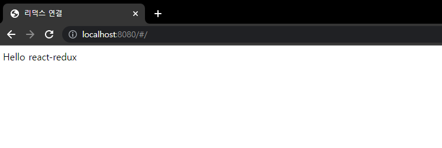

# 02. react-redux

## 02-01. 리덕스 폴더 구조

우선 새 폴더를 만들고 01에서 작성한 코드를 가져와 살펴보자.

별로 한게 없지만 90줄이 넘어간다.

잘게 쪼개보자.


**우선 reducer를 reducer.js로 분리**

분리가 쉬운게 **순수함수**라 그렇다.

> 순수 함수
>
> 매개변수와 함수 내부에서 선언한 변수를 빼고는 다른 것을 참조하지 않는 함수

```js
// reducer.js
const reducer = (prevState, action) =>{
  switch(action.type){
    case 'LOG_IN':
      return{
        ...prevState,
        user: action.data,
      }
    case 'LOG_OUT':
      return{
        ...prevState,
        user: null,
      }
    case 'ADD_POST':
      return{
        ...prevState,
        posts: [...prevState.posts, action.data],
      }
    default: return prevState;
  }
};

module.exports = reducer;
```

```js
// index.js
const reducer = require('./reducer');
...
```


그 다음 길어질 만한게 **action creator들**

```js
// action.js
const login = (data) => {
  return {
    type:'LOG_IN',
    data,
  }
}
const logout = () => {
  return {
    type:'LOG_OUT',
  }
}
const addPost = (data) =>{
  return{
    type:'ADD_POST',
    data
  }
}

module.exports = {
  login,
  logout,
  addPost
};
```

```js
// index.js
const {login, logout, addPost, } = require('./action');
...
```

>  ❗ Tip
>
> action과 reducer들이 길어지게 되면, 또 그안에서 나누어야 되는 경우도 있을 수 있다.
>
> 그럴 땐 actions폴더 reducers폴더를 만들어 카테고리별로 구분하여 만들어 관리하는 방법도 있다.


reducers폴더안에 index.js파일을 만들어 옮겨보자.<br>(보통 대표가 되는 파일을 index.js로 만든다.)

그리고 action도 장기적인 관점으로 봤을 때 user관련 actiion인 login, logout과 게시글 관련인 addPost를 나누는게 좋아 보인다. 

```js
// action/user.js
const login = (data) => {
  return {
    type:'LOG_IN',
    data,
  }
}
const logout = () => {
  return {
    type:'LOG_OUT',
  }
}

module.exports={
  login, logout
}
```

```js
// action/post.js
const addPost = (data) =>{
  return{
    type:'ADD_POST',
    data
  }
}

module.exports = {addPost}
```


❗ state의 구조에 따라 파일을 분리하는게 좋다. => **state 구조를 잘짜는게 중요**

**example**

```js
const initialState = {
    user: null,
    isLoggingIn: true,
    posts: [],
    comments: [],
    favorites: [],
    history: [],
    likes: [],
    followers: [],
}
```

이와 같은 경우가 있다고 할때 comments가 게시글에 묶여있으니 posts안에 넣는 경우도 있을 수 있다.

하지만 comments의 덩치가 커질 수 있으니 밖으로 빼는게 좋다. 

=> 연관있는건 묶는게 좋지만, 덩치가 커질만한건 따로 구분하는게 좋다.


Q. 이런 객체들이 늘어나면 성능 문제는 없는가?

A. 메모리에 많이 차지하긴 하지만, 엄청나게 많이 차지하진 않는다.<br/> 메모리 관리가 필요한 상황(ex)infinite scroll)이 생길 순 있지만, 큰 문제는 생기지 않는다.

서비스마다 다르긴하지만, 데이터를 가져올 때는 한 페이지에 보이는 정도만 가져오는게 좋다.

페이스북처럼 빠르게 빠르게 글들을 넘겨봐야할 때는 많이 가져오는게 좋지만, 블로그같은 경우는 한페이지에 보이는 정도만 가져오는게 좋다.


## 02-02. combineReducer

action을 쪼갠것 처럼 reducer를 쪼개보자.

reducer는 함순데 어떻게?

**이부분은 redux에서 제공한다. => combineReducers**

우선 2개로 나눠보자.

```js
const {combineReducers} = require('redux');

const userReducer = (prevState, action) =>{
  switch(action.type){
    case 'LOG_IN':
      return{
        ...prevState,
        user: action.data,
      }
    case 'LOG_OUT':
      return{
        ...prevState,
        user: null,
      }
    default: return prevState;
  }
};
const postReducer = (prevState, action) =>{
  switch(action.type){
    case 'ADD_POST':
      return{
        ...prevState,
        posts: [...prevState.posts, action.data],
      }
    default: return prevState;
  }
};
```

일단 나눴는데 함수 2개를 어떻게 합칠까?

combineReducers를 사용!

```js
combineReducers({
  user: userReducer,
  posts: postReducer
})
```

이제 파일을 분리할 수 있게 되었다.

```js
// reducers/index.js
const {combineReducers} = require('redux');
const userReducer = require('./user');
const postReducer = require('./post');

module.exports = combineReducers({
  user: userReducer,
  posts: postReducer
});
```

❗ combineReducers안의 객체에 key값들이 initalState를 따라간다고 보면된다.


구조가 변경되어 수정이 필요하다.

**prevState가 더이상 initialState가 아니다.**

postReducer를 예로 들면, prevState가 posts로 범위가 좁아졌다.

그래서 그냥 prevState로 수정해줄 수 있다.


❗ shapeAssertionError 발생

prevState에 initialState에 작성된 형태의 기본값을 넣어주어 해결

```js
// reducers/user.js
const initialState = {
  isLoggingIn: false,
  data: null,
};
const userReducer = (prevState = initialState, action) =>{
  switch(action.type){
    case 'LOG_IN':
      return{
        ...prevState,
        data: action.data,
      }
    case 'LOG_OUT':
      return{
	    isLoggingIn: false,
        data: null,
      }
    default: return prevState;
  }
};
module.exports=userReducer;
```

```js
// reducers/post.js
const initialState = [];
const postReducer = (prevState=initialState, action) =>{
  switch(action.type){
    case 'ADD_POST':
      return [...prevState, action.data];
    default: return prevState;
  }
};

module.exports = postReducer;
```

**결과**

```shell
1st initialState { user: { isLoggingIn: true, data: null }, posts: [] }
chagned
2nd login {
  user: {
    isLoggingIn: true,
    data: { id: 1, name: 'JuneHyung', admin: true }      
  },
  posts: []
}
chagned
3rd addPost {
  user: {
    isLoggingIn: true,
    data: { id: 1, name: 'JuneHyung', admin: true }      
  },
  posts: [ { userId: 1, id: 1, content: 'Hello Redux' } ]
}
chagned
4th addPost {
  user: {
    isLoggingIn: true,
    data: { id: 1, name: 'JuneHyung', admin: true }
  },
  posts: [
    { userId: 1, id: 1, content: 'Hello Redux' },
    { userId: 1, id: 2, content: 'Hello Redux2' }
  ]
}
chagned
5th logout {
  user: { isLoggingIn: false, data: null },
  posts: [
    { userId: 1, id: 1, content: 'Hello Redux' },
    { userId: 1, id: 2, content: 'Hello Redux2' }
  ]
}
```


## 02-03. 리덕스 미들웨어

action들은 기본적으로 **동기** 이다.

**action은 그냥 객체고, dispatch는 그 객체를 받아 dispatch하는 역할이라 그사이에 비동기를 동작할 틈이 없다.**

그래서 제공하는 것이 **미들웨어**.

dispatch와 reducer사이에서 동작하는 게 미들웨어다.


`redux-thunk`와 `redux-saga`가 유명하다

항상 비동기를 위해서만 사용하는게 아니라 dispatch와 reducer사이에서 어떠한 동작을 하는 경우 사용한다.

공식문서에서는 Logging하는 middleware 예제를 소개해준다.

[📘 공식문서 Logging example](https://ko.redux.js.org/understanding/history-and-design/middleware/#understanding-middleware)


middleware를 만들어보자.

`createStore`의 3번째 파라미터가  `enhancer`라는 자리이다.<br/>(미들웨어를 통해서 기존 redux가 할 수 없는 **기능을 덧붙이는(증강시키는) 역할**)

```js
// index.js
const {createStore, compose, applyMiddleware} = require('redux');
...
const enhancer = compose(
  applyMiddleware(),
)
// const enhancer = applyMiddleware()

const store = createStore(reducer, initialState, enhancer);
```

compose없이 선언해도 동작한다.

compose가 합성하는 함수이다. => applyMiddleware말고, devtool같은 걸 추가적으로 붙일 때 compose로 합성해준다.

applyMiddleware에는 3단 고차함수가 들어간다.

```js
const firstMiddleware = (store) => (next) => (action) =>{

};

const enhancer = compose(
  applyMiddleware(firstMiddleware),
)
```

위 고차함수는 아래와 같다.

```js
function firstMiddleware(){
    return function(next){
        return function(action){
            
        }
    }
}
```

이런 중첩된 형태를 가지는 이유가 있다.

**실행되는 시점의 차이.**

store와 next 사이에서 어떤 동작을 원하면 사이에서 작성하고,

next와 action사이면 사이 에서 작성.

만약 사이사이 동작할게 필요없다면 가장 위와같은 형태가 된다.

```js
const firstMiddleware = (store) => (next) => (action) =>{
  console.log(action)
  next(action)
};
```

**next가 dispatch 라고 생각하면 된다.**

console이 없다면 기본기능일텐데 console을 추가함으로 써 dispatch시 로깅하게 된다.

**실행결과**

```shell
1st initialState { user: { isLoggingIn: true, data: null }, posts: [] }
액션 로깅 { type: 'LOG_IN', data: { id: 1, name: 'JuneHyung', admin: true } }
chagned
액션 끝
2nd login {
  user: {
    isLoggingIn: true,
    data: { id: 1, name: 'JuneHyung', admin: true }
  },
  posts: []
}
액션 로깅 {
  type: 'ADD_POST',
  data: { userId: 1, id: 1, content: 'Hello Redux' }
}
chagned
액션 끝
3rd addPost {
  user: {
    isLoggingIn: true,
    data: { id: 1, name: 'JuneHyung', admin: true }
  },
  posts: [ { userId: 1, id: 1, content: 'Hello Redux' } ]
}
액션 로깅 {
  type: 'ADD_POST',
  data: { userId: 1, id: 2, content: 'Hello Redux2' }
}
chagned
액션 끝
4th addPost {
  user: {
    isLoggingIn: true,
    data: { id: 1, name: 'JuneHyung', admin: true }
  },
  posts: [
    { userId: 1, id: 1, content: 'Hello Redux' },
    { userId: 1, id: 2, content: 'Hello Redux2' }
  ]
}
액션 로깅 { type: 'LOG_OUT' }
chagned
액션 끝
5th logout {
  user: { isLoggingIn: false, data: null },
  posts: [
    { userId: 1, id: 1, content: 'Hello Redux' },
    { userId: 1, id: 2, content: 'Hello Redux2' }
  ]
}
```

이를 이용해 비동기 처리도 할 수 있다.


## 02-04. redux-thunk

middleware는 여러개를 연결할 수 있다.

thunkMiddleware를 만들어보자.

❗ 참고 `react-thunk`는  react 비동기를 제어하는 유명한 미들웨어이다.

```js
// index.js
...

const firstMiddleware = (store) => (dispatch) => (action) =>{
  console.log('로깅', action)
  // 기능 추가
  dispatch(action)
};

const thunkMiddleware = (store) => (dispatch) => (action) =>{
  const thunkMiddleware = (store) => (dispatch) => (action) =>{
  if(typeof action === 'function'){ // 비동기
    return action(store.dispatch, store.getState);
  }
  return dispatch(action)
};
  return dispatch(action)
};

const enhancer = compose(
  applyMiddleware(
    firstMiddleware, 
    thunkMiddleware,
  ),
)
```

비동기인 경우 action을 함수로 넣는다는 약속을 하고, 비동기처리를 할 것이다.

기본적으로 action은 동기이다. 동기이면 => 객체.

**정리**

* action이 함수로 오면 => 비동기

* action이 그외로 오면 => 동기

위처럼 약속.


그럼 어디로 전달되는가?

**우선 비동기 액션은 함수로 만들 것이다. action creator랑 잘 구분해야 한다.**

```js
// action/user.js
const login = () => { // async action creator
  return (dispatch, state)=>{
    dispatch(loginRequest());
    setTimeout(()=>{ // 임의로 
      dispatch(loginSuccess());
    }, 2000)
  }
}

const loginRequest = () =>{ // sync action creator
  return {}
}
const loginSuccess = () =>{ // sync action creator
  return {}
}
```

동기 액션들 간에 실행 순서를 조작하는 정도이다.


마저 수정해보자.

주의 깊게 볼 부분은 data다.

``` js
// action/user.js
const login = (data) => { // async action creator
  return (dispatch, getState)=>{
    dispatch(loginRequest(data));
    setTimeout(()=>{ // 임의로 
      dispatch(loginSuccess({
        userId: 1,
        nickname: 'zero'
      }));
    }, 2000)
  }
}

const loginRequest = (data) =>{
  return {
    type:'LOG_IN_REQUEST',
    data,
  }
}
const loginSuccess = () =>{
  return {
    type:'LOG_IN_SUCCESS',
    data,
  }
}

```

```js
const login = (data) => { // dispatch로 넘긴 데이터
  return (dispatch, getState)=>{ // dispatch에서 reducer로 가기전 미들웨어에서 주는 dispatch와 getState
    dispatch(loginRequest(data));
    setTimeout(()=>{ // 임의로 
      dispatch(loginSuccess({
        userId: 1,
        nickname: 'zero'
      }));
    }, 2000)
  }
}
```

좀 햇갈리는데 주석처럼 이해했다.


**다시 한번 정리**

```js
const thunkMiddleware = (store) => (dispatch) => (action) =>{
  if(typeof action === 'function'){
    return action(store.dispatch, store.getState);
  }
  return dispatch(action)
};
```

1. dispatch로 객체가 올수도 함수로 올 수도 있다.<br/>함수로 오는 경우 비동기 처리를 하는 것으로 약속.
2. 만약 객체로 왔다면 그냥 기본동작을 시킨다. `return dispatch(action)`
3. 함수 인경우 `action(store.dispatch, store.getState)`가 동작.

```js
const login = (data) => { // dispatch로 넘긴 데이터
  return (dispatch, getState)=>{ // dispatch에서 reducer로 가기전 미들웨어에서 주는 dispatch와 getState
    dispatch(loginRequest(data));
    setTimeout(()=>{ // 임의로 
      dispatch(loginSuccess({
        userId: 1,
        nickname: 'zero'
      }));
    }, 2000)
  }
}
```

4. 미들웨어는 dispatch -> reducer로 가기전에 동작하기 때문에 함수 형태도 dispatch로 받은 data가 가장밖에서 받고, return부분에 middleware에서 받은 dispatch와 getState값을 파라미터로 받는다.<br/>return부분이 원래 action creator의 action자리이니까.

> 왜 redux-thunk를 가져오지 않고, 만들어 쓰는가?
>
> 실제로 redux-thunk의 내용도 지금 작성한것과 다를 바 없다.
>
> [📘 redux.js의 redux-thunk Github](https://github.com/reduxjs/redux-thunk/blob/master/src/index.ts)

추가적인 에러처리

```javascript
const login = (data) => { // async action creator
  return (dispatch, getState)=>{
    dispatch(loginRequest(data));
    try{
      setTimeout(()=>{ // 임의로 
        dispatch(loginSuccess({
          userId: 1,
          nickname: 'zero'
        }));
      }, 2000)
    }catch(e){
      dispatch(loginFailure(e))
    }
  }
}

const loginRequest = (data) =>{
  return {
    type:'LOG_IN_REQUEST',
    data,
  }
}
const loginSuccess = () =>{
  return {
    type:'LOG_IN_SUCCESS',
    data,
  }
}
const loginFailure = (error) =>{
  return {
    type:'LOG_IN_FAILURE',
    error,
  }
}
```

함수의 형태가 `firstMiddleware = (store, dispatch, action) => {...}`이 아닌 이유는 함수형 프로그래밍의 특성(매개 변수는 하나만 받음) 때문.

이런 방식을 **커링 방식(Currying)** 이라한다.

> **고차함수와 커링(Currying) 기법**
>
> 고차함수는 함수를 인자로 전달받거나 리턴값으로 함수를 반환하는 함수를 의미.
>
> ```js
> const demo = function (){
>     console.log('demo')
> }
> 
> const a = function(func) {
>     function b(word){
>         func();
>         console.log(word);
>     }
>     return b;
> }
> 
> const test = a(demo);
> test("testing");
> // demo 출력
> // testing출력
> 
> //----------------------------------------------------------------
> 
> function a = (func) => (word) => {
>     func();
>     console.log(word);
> }
> ```
>
> 
>
> 커링기법은 인자가 여러개인 함수의 일부 인자를 고정시키는 새로운 함수를 만드는 기법.
>
> 즉, 인자가 n개인 함수를 n개로 분리하여 사용하게끔 만드는 기법.
>
> 일부 인자에 같은 값을 반복적으로 사용할 떄 그 반복되는 인자를 고정함으로써 중복을 최소화 하기에 적합한 기법
>
> ```js
> function helloFunc(word, name, word2, name2) {
>     console.log(`${word}, ${name} || ${word2}, ${name2}`);
> }
> //------------------------------------------------------------------------------
> function helloFunc(word) {
>     return function (name) {
>         return function(word2){
>             return function(name2){
>                 console.log(`${word}, ${name} || ${word2}, ${name2}`)
>             }
>         }
>     };
> }
> //------------------------------------------------------------------------------
> const helloFunc = (word) => (name) => (word2) => (name2) => {
>     console.log(`${word}, ${name} || ${word2}, ${name2}`);
> };
> ```
>
> ❗ 인자의 순서가 매우 중요하다.
>
> 변동가능성이 적은 인자는 앞, 변동가능성이 큰 인자는 뒤에 배치.
>
> [📘 고차함수와 커링기법 참고](https://tibetsandfox.tistory.com/32)


**결과**

 ```javascript
 // index.js
 const {createStore, compose, applyMiddleware} = require('redux');
 
 const reducer = require('./reducers');
 const {login, logout } = require('./actions/user');
 const {addPost } = require('./actions/post');
 
 const initialState = {
   user: {
     isLoggingIn: true,
     data:null,
   },
   posts: [],
   // comments: [],
   // favorites: [],
   // history: [],
   // likes: [],
   // followers: [],
 }
 
 const firstMiddleware = (store) => (dispatch) => (action) =>{
   console.log('로깅', action)
   // 기능 추가
   dispatch(action)
 };
 
 const thunkMiddleware = (store) => (dispatch) => (action) =>{
   if(typeof action === 'function'){
     return action(store.dispatch, store.getState);
   }
   return dispatch(action)
 };
 
 const enhancer = compose(
   applyMiddleware(
     firstMiddleware, 
     thunkMiddleware,
   ),
 )
 
 const store = createStore(reducer, initialState, enhancer);
 
 console.log('1st initialState',  store.getState());
 store.dispatch(login({
   id: 1,
   name: 'zero',
   admin: true,
 }))
 console.log('2nd login',  store.getState());
 ```


2초뒤에 SUCCESS부분이 출력되는걸 확인할 수 있다.

```shell
1st initialState { user: { isLoggingIn: true, data: null }, posts: [] }
로깅 [Function (anonymous)]
로깅 { type: 'LOG_IN_REQUEST', data: { id: 1, name: 'zero', admin: true } }
2nd login { user: { isLoggingIn: true, data: null }, posts: [] }
로깅 { type: 'LOG_IN_SUCCESS', data: { userId: 1, nickname: 'zero' } }
```


❗ thunk는 간단하지만, 비동기는 복잡하다. 비동기끼리 서로 얽히다가 thunk만으로 해결이 어려울때  `redux-saga`를 사용.


## 02-05. react-redux

react에서 해보자.

### 프로젝트 세팅 

(webgame의 mineSearch때 사용한 세팅에 추가,변경)

```shell
npm i react react-dom
npm i -D @babel/core @babel/preset-env @babel/preset-react babel-loader
npm i-D react-hot-loader webpack webpack-cli webpack-dev-server
```

그리고 react와 redux를 연결하기 위해서 react-redux가 필요하다

```shell
npm i react-redux
```


`client.jsx`에서는 App을 렌더하도록 수정.

```jsx
// client.jsx
import React from 'react';
import ReactDOM from 'react-dom/client';

import App from './App';

ReactDOM.createRoot(document.querySelector('#root')).render(<App />);
```


index.html 추가

```html
<!DOCTYPE html>
<html lang="ko">
<head>
  <meta charset="UTF-8">
  <meta http-equiv="X-UA-Compatible" content="IE=edge">
  <meta name="viewport" content="width=device-width, initial-scale=1.0">
  <title>리덕스 연결</title>
</head>
<body>
  <div id="root"></div>
  <script src="./dist/app.js"></script>
</body>
</html>
```

App.jsx 작성 후 실행 시켜 확인해보기.

```jsx
import React from 'react';

const App = () => {
  return (
    <div>Hello react-redux</div>
  )
};

export default App;
```




이전에 작업한 actions와 reducers폴더를 옮기고 기존에 작성한 index.js는 store.js로 변경

```javascript
// store.js
...
const store = createStore(reducer, initialState, enhancer);

module.exports = store;
```


store를 client에서 Provider로 감싸준다.

```jsx
// client.jsx
import React from 'react';
import ReactDOM from 'react-dom/client';
import { Provider } from 'react-redux';
import store from './store';

import App from './App';

ReactDOM.createRoot(document.querySelector('#root')).render(
<Provider store={store}>
  <App />
</Provider>
);

```

이러면 react, react-redux, redux가 연결되었다


App.jsx를 수정해보자.

```jsx
import React, { useCallback } from 'react';
import { useDispatch, useSelector } from 'react-redux';
import { login } from './actions/user';

const App = () => {
  const user = useSelector((state)=>state.user.data)
  const dispatch = useDispatch();
  const onClick = useCallback(() =>{
    dispatch(login({
      id: 'jhjoe',
      password: '비밀번호'
    }))
  }, [])
  return (
    <div>
      {user ? <div>{user.nickname}</div> : '로그인 해주세요.'}
      <button onClick={onClick}>로그인</button>
    </div>
  )
};

export default App;
```

❗ `react-redux`에는 useDispatch와 useSelector가 있다.

useDispatch는 dispatch를 하기위한 함수, useSelector는 state에서 원하는 data를 고르는 함수.

로그인 버튼을 눌러 확인이 가능하다.

`redux-devtools`를 통해  기록 확인이 가능.


## 02-06. QnA

우선 이름이 계속 출력되지 않는다.

이전에 action으로 success와 failure를 만들었는데 reducer들을 안만들어 줌.

(상수는 별도 파일로 분리하였다.)

```javascript
// reducers/user.js
const { LOG_IN_REQUEST, LOG_IN_SUCCESS, LOG_IN_FAILURE, LOG_OUT } = require("../constant");

const initialState = {
  isLoggingIn: false,
  data: null,
};
const userReducer = (prevState = initialState, action) =>{
  switch(action.type){
    case LOG_IN_REQUEST:
      return{
        ...prevState,
        data:null,
        isLoggingIn: true,
      }
    case LOG_IN_SUCCESS:
      return{
        ...prevState,
        data: action.data,
        isLoggingIn: true,
      }
    case LOG_IN_FAILURE:
        return{
          ...prevState,
          data: null,
          isLoggingIn: false,
        }
    case LOG_OUT:
      return{
        ...prevState,
        data: null,
      }
    default: return prevState;
  }
};

module.exports=userReducer;
```


App.jsx에서 로그인함에 따른 display변경과 로그아웃버튼을 추가해보자.

```jsx
// App.jsx
import React, { useCallback } from 'react';
import { useDispatch, useSelector } from 'react-redux';
import { login, logout } from './actions/user';

const App = () => {
  const user = useSelector((state)=>state.user)
  const dispatch = useDispatch();
  const onClick = useCallback(() =>{
    dispatch(login({
      id: 'jhjoe',
      password: '비밀번호'
    }))
  }, [])
  const onLogout = useCallback(() =>{
    dispatch(logout())
  }, [])
  return (
    <div>
      {user.isLoggingIn 
        ? <div>로그인 중</div> 
        : user.data 
        ? <div>{user.data.nickname}</div> 
        : '로그인 해주세요.'
      }
      {!user.data ? <button onClick={onClick}>로그인</button> : <button onClick={onLogout}>로그아웃</button>}
    </div>
  )
};

export default App;
```

Q. 비동기 액션들을 click메서드에서 바로 처리해도 되지않는가.?

A. 가능은 하지만, 관리측면에서 분리하는게 좋다.


## 02-07. redux-devtools와 connect

redux-devtools 설정 해보자.

```shell
npm i -D redux-devtools-extension
```

개발용으로 설치.

배포환경이 아니라 client가 접속하는 환경에서 devtools를 쓰게되면, 웹프로젝트의 데이터가 redux에 모아져있기 때문에 유출될 수도 있다.

`composeWithDevTools`를 가져와 enhancer에서 작성한 applyMiddleware를 composeWthDevTools안에 넣으면된다.

```jsx
composeWithDevTools(
    applyMiddleware(
        firstMiddleware,
        thunkMiddleware,
    ),
);
```

만약 배포환경에서 사용하고 싶지 않다면

```jsx
const enhancer = process.env.NODE_ENV === 'production'
? compose(
    applyMiddleware(
        firstMiddleware,
        thunkMiddleware,
    ),
)
: composeWithDevTools(
    applyMiddleware(
        firstMiddleware,
        thunkMiddleware,
    ),
);
```

이런 식으로 production인 경우 compose만, 아니라면 composeWithDevTools를 사용.


기존 class 컴포넌트에서 기존방식인 connect와 reducer를 편하게 사용할 수 있는 immer에 대해 알아보자.

기존 작성한 파일들을 복사해서 class로 바꾸어 진행.

```jsx
import React, { useCallback } from 'react';
import { connect } from 'react-redux';
import { login, logout } from './actions/user';
class App{
  onClick = ()=>{
    dispatch(login({
      id: 'jhjoe',
      password: '비밀번호'
    }))
  }
  onLogout = () =>{
    dispatch(logout())
  }
  render(){
    const {user} = this.props;
return (
    <div>
      {user.isLoggingIn 
        ? '로그인 중'
        : user.data 
        ? user.data.nickname
        : '로그인 해주세요.'}
      {!user.data 
        ? <button onClick={this.onClick}>로그인</button> 
        : <button onClick={this.onLogout}>로그아웃</button>}
    </div>
  )
  }
}

export default connect()(App);
```

class에서는 connect를 사용. 하이오더컴포넌트를 이용해 App을 확장.

Hooks에서 처럼 state와 dispatch를 가져와야한다.

```jsx
// App.jsx
...

const mapStateToProps = (state) => ({
  user: state.user,
}) // reselct
const mapDispatchToProps = (dispatch) => ({
  dispatchLogin:(data)=> dispatch(login(data)),
  dispatchLogout: ()=> dispatch(logout()),
})
```

❗ 문제가 있다.

컴포넌트가 렌더링 될때마다 실행하게 되서 성능상의 문제가 발생할수 있다.

=> `reselect`를 써야한다.


mapStateToProps와 mapDispatchToProps에 선언한 것들은 props에서 받을 수 있다.

```jsx
class App{
  onClick = ()=>{
    this.props.dispatchLogin({
      id: 'jhjoe',
      password: '비밀번호'
    })
  }
  onLogout = () =>{
    this.props.dispatchLogin()
  }
  render(){
    const {user} = this.props;
return (
    ...
)}
```


## 02-08. immer

reducer에서 불변성을 지키기 위해 스프레드 연산자를 사용하는게 직관적이지 않다.

좀 깊이가 있는 값을 바꾼다고 가정해보자.

아래처럼 계속 써줘야한다.

```jsx
state.deep.depper.deepest.a = 'b';
// -------------------------------------------------
return {
    deep: {
        ...prevState.deep,
        deeper:{
            ...prevState.deepper,
            deepest: {
                ...prevState.deepest,
                a
            }
        }
    }
}
```


immer 설치

```shell
npm i immer
```

기본 형태

```jsx
const produce = require('immer')

nextState = produce(prevState, (draft)=>{})
```

produce함수는 이전 상태를 바탕으로 액션을 받아서 nextState를 만든다고 생각.

draft는 prevState의 복사본이라 생각하면 된다.

prevState는 불변성을 지키기 위해 냅두고 그 복사본인 draft를 수정하는 형식.

그에따라 reducer를 수정해보자. 

```jsx
// reducers/user.js
const userReducer = (prevState = initialState, action) =>{
  return produce(prevState, (draft)=>{
    switch(action.type){
      case LOG_IN_REQUEST:
        draft.data = null;
        draft.isLoggingIn = true;
        break;
      case LOG_IN_SUCCESS:
        draft.data = action.data;
        draft.isLoggingIn = false;
        break;
      case LOG_IN_FAILURE:
        draft.data = null;
        draft.isLoggingIn = false;
        break;
      case LOG_OUT:
        draft.data = null;
        break;
      default: break;
    }
  })
};
```

code가 엄청 줄어든걸 확인할 수 있다. 👍

post도 수정.

```js
const { ADD_POST } = require("../constant");
const produce = require('immer')

const initialState = [];
const postReducer = (prevState=initialState, action) =>{
  return produce(prevState, (draft)=>{
    switch(action.type){
      case ADD_POST:
        draft.push(action.data);
        break;
      default: break;
    }
  })
};

module.exports = postReducer;
```

zerocho님 gtihub의 nodebird 챕터 6와 챕터 7의 차이를 비교.(아래 링크는 챕터7)


```jsx
// App.jsx
import React, { Component } from "react";
import { connect } from "react-redux";
import { login, logout } from "./actions/user";

class App extends Component {
  onClick = () => {
    this.props.dispatchLogin({
      id: "jhjoe",
      password: "비밀번호",
    });
  };
  onLogout = () => {
    this.props.dispatchLogout();
  };
  render() {
    const { user } = this.props;
    return (
      <div>
        {user.isLoggingIn ? "로그인 중" : user.data ? user.data.nickname : "로그인 해주세요."}
        {!user.data ? <button onClick={this.onClick}>로그인</button> : <button onClick={this.onLogout}>로그아웃</button>}
      </div>
    );
  }
}

const mapStateToProps = (state) => ({
  user: state.user,
}); // reselct
const mapDispatchToProps = (dispatch) => ({
  dispatchLogin: (data) => dispatch(login(data)),
  dispatchLogout: () => dispatch(logout()),
});
export default connect(mapStateToProps, mapDispatchToProps)(App);

```


> ❗ 참고
>
> import 와 require를 쉽게 바꿀 수 있다고 생각할 수 있다.
>
> 하지만 두개가 다른 기능인걸 알아야한다.
>
> 차이점 한가지만 말하자면, default가 다르다.


📘 [nodebird Github chapter7 reducer](https://github.com/ZeroCho/react-nodebird/blob/master/ch7/front/reducers/user.js)