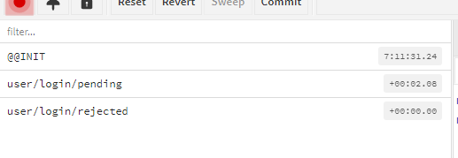

# 03. redux-toolkit

## 03-01. 툴킷을 선택한 이유

리덕스에서 자주 쓰는 기능들을 모아 둔 라이브러리.

thunk, immer, createAction, createReducer등등 내장되어있다.


**package.json**<br/>(버전 확인 - 강의는 react 17버전이용)

```json
{
  "name": "05.react-redux-toolkit",
  "version": "1.0.0",
  "description": "",
  "main": "index.js",
  "scripts": {
    "dev": "webpack serve --env development"
  },
  "author": "",
  "license": "ISC",
  "dependencies": {
    "react": "^18.1.0",
    "react-dom": "^18.1.0",
    "react-redux": "^8.0.5",
    "@reduxjs/toolkit": "^1.5.0"
  },
  "devDependencies": {
    "@babel/core": "^7.11.6",
    "@babel/preset-env": "^7.11.5",
    "@babel/preset-react": "^7.10.4",
    "@pmmmwh/react-refresh-webpack-plugin": "^0.5.7",
    "babel-loader": "^8.1.0",
    "react-refresh": "^0.13.0",
    "redux-devtools-extension": "^2.13.9",
    "webpack": "^5.3.2",
    "webpack-cli": "^4.1.0",
    "webpack-dev-server": "^4.0.0"
  }
}
```

**webpack.config.js**

Plugin가져와 등록한 것 확인.

```javascript
const path = require('path');
const ReactRefreshWebpackPlugin = require('@pmmmwh/react-refresh-webpack-plugin');

module.exports = {
 ...
  module: {
    rules: [{
      test: /\.jsx?$/,
      loader: 'babel-loader',
      options: {
        presets: [
          ['@babel/preset-env', {
            targets: {browsers: ['last 2 chrome versions']},
            debug: true,
          }],
          '@babel/preset-react',
        ],
        plugins: ["react-refresh/babel"]
      },
      exclude: path.join(__dirname, 'node_modules'),
    }],
  },
  plugins: [
    new ReactRefreshWebpackPlugin(),
  ],
 ...
};
```

[📘 Redux Toolkit 공식문서](https://redux-toolkit.js.org/)

`createSlice`와 `createAsyncThunk`가 가장 많이 사용된다.

❗ 공식문서 읽어보자.


store.js를 toolkit을 이용해 수정해보자

``` js
const {configureStore} = require('@reduxjs/toolkit');

const reducer = require('./reducers');
const {login, logout } = require('./actions/user');
const {addPost } = require('./actions/post');


const firstMiddleware = (store) => (dispatch) => (action) =>{
  console.log('로깅', action)
  // 기능 추가
  dispatch(action)
};

const store = configureStore(reducer, );

module.exports = store;
```

configureStore안에 devtools나 thunk, initialState 다 들어가있다.

```javasc
configureStore(reducer, preloadedState );
```

`preloadedState`라고 있는데, initialState와 동일한데, SSR할 때 서버에서 initialState를 받는 경우에만 넣어주면 된다.


```javascript
const store = configureStore({
  reducer, 
  // preloadedState 
  middleware: [firstMiddleware],
});
```

custom한 middleware를 저렇게 넣을 수 있는데, 저런식으로 작성하면 toolkit이 가지고있는 thunkMiddleware같은건 제외된다.

`getDefaultMiddleware()`를 가져와 같이 선언해주면된다.

```javascript
const store = configureStore({
  reducer, 
  // preloadedState 
  middleware: [firstMiddleware, ...getDefaultMiddleware()],
  devTools: process.env.NODE_ENV !== 'production',
});
```

enhancer는 있긴한데 거의 안씀.


## 03-02. 새롭게 등장한 slice

reducer부분을 toolkit으로 바꿔보자.

```javascript
// reducers/index.js
const {combineReducers} = require('redux');
// const userReducer = require('./user');
// const postReducer = require('./post');
const userSlice = require('./user');
const postSlice = require('./post');

module.exports = combineReducers({
  user: userSlice.reducer,
  posts: postSlice.reducer,
});
```

slice는 reducer뿐만 아니라 action, 초기 state등등 여러가지가 들어있다.

거의 특정 action은 특정 reducer에 종속되있기 때문에 합쳐놨다.

❗ user에 slice가 아니라 slice안의 reducer를 넣은것 주의!

먼저, postReducer변경.

```javascript
const {createSlice} = require('@/reduxjs/toolkit')

const { ADD_POST } = require("../constant");

const initialState = {
  data:[],
};

const postSlice = createSlice({
  name: 'post',
  initialState, 
  reducers: {}, // 동기적
  extraReducers:{}, // 비동기적
})

module.exports = postSlice;
```

* `reducers`는 동기적인 action이거나 내부적인 action,
* `extraReducers`는 비동기적인 action이거나 외부적인 action이다.


logout이 동기처리 된다 가정하고 해보자.

```javascript
// reducers/user.js
const {createSlice} = require('@/reduxjs/toolkit')

const initialState = {
  isLoggingIn: false,
  data: null,
};
const userSlice = createSlice({
  name: 'user',
  initialState, 
  reducers: {
    logout(state, action){
      state.data = null;
    }
  }, // 동기적
  extraReducers:{}, // 비동기적
})

module.exports=userSlice;
```

toolkit이 알아서 만들어 줘서 action이 필요없어지게 된다.

```javascript
// 삭제
// const logout = () => {
//   return {
//     type: LOG_OUT,
//   }
// }
```

App.jsx에서는 userSlice를 가져와 사용하면 된다.

```jsx
// App.jsx
import React, { useCallback } from 'react';
import { useDispatch, useSelector } from 'react-redux';
import { login, logout } from './actions/user';

const userSlice = require('./reducers/user');

const App = () => {
 ..
  const onLogout = useCallback(() =>{
    dispatch(userSlice.actions.logout())
  }, [])
  return (
    ...
  )
};

export default App;
```


비동기 요청을 해보자.

slice안에 thunk를 이용할 것이다.

비동기 액션은 slice와 하나로 묶인게 아니라 다른곳에서도 쓸 수 있기 때문에, action을 만들어 주어야한다.

```javascript
const {createAsyncThunk} = require('@reduxjs/toolkit');

const login = createAsyncThunk('user/login', async(data, thunkAPI)=>{
  // const state = thunk.API.getState();
  // state.user.data 
})
```

* 'user/login' : 액션의 이름

* data : 액션호출받는 data, 

* thunkAPI


thunk에서는 `pending`, `fulfilled`, `rejected`로 용어를 사용한다. (대기, 성공, 실패)


## 03-03. createAsyncThunk로 비동기 처리하기

서버가 따로없기 때문에 통신이 왔다 온다 생각하고, delay를 주어 테스트해볼 것이다.

```javascript
const delay = (time, value) => new Promise((resolve, reject)=>{
  setTimeout(()=>{
    resolve(value);
  }, time)
})

const login = createAsyncThunk('user/login', async(data, thunkAPI)=>{
  // const state = thunk.API.getState();
  // pending, fullfilled, rejected
  console.log(data)
  const result = await delay(500, {
    userId: 1,
    nickname: 'zero'
  });
  return result ;
})
```

❗ 보통 async await를 쓸 때 try catch로 감싸는데, 여기서는 안감싸는게 좋다. => 감싸버리면 error가 발생하지 않는다.

dispatch로 보내는 객체가 data가 된다.


reducer 수정

```javascript
const {createSlice} = require('@/reduxjs/toolkit')
const {login} = require('../actions/user');
const { LOG_IN_REQUEST, LOG_IN_SUCCESS, LOG_IN_FAILURE, LOG_OUT } = require("../constant");
...
const userSlice = createSlice({
  name: 'user',
  initialState, 
  reducers: {
    logout(state, action){
      state.data = null;
    }
  }, // 동기적
  extraReducers:{
    [login.pending](state,action){
      state.isLoggingIn = true;
    },
    [login.fulfilled](state, action){
    state.data = action.payload
      state.isLoggingIn = false;
    },
    [login.rejected](state, action){
    state.data = action.payload
      state.isLoggingIn = false;
    }
  }, // 비동기적
})

module.exports=userSlice;
```

❗ action의 데이터는 action.data가 아니라 `payload`이다.

> 정리
>
> Toolkit은 redux에서 자주 사용하는 것들을 모아놓은 라이브러리.
>
> 그렇기 때문에 미리 만들기 때문에 명칭이 미리 **정해져 있다**.
>
> 대기 -> pending
>
> 성공 -> fulfilled
>
> 실패 -> rejected
>
> action의 data => payload

action의 이름을 넣는 이유

extraReducer에서 변수명이 자동으로 만들어져 구분. => user/logIn/fulfilled


post의 addPost도 비동기로 해보자.

```javascript
// actions/post.js
const {createAsyncThunk} =require('@reduxjs/toolkit');

const delay = (time, value) => new Promise((resolve, reject)=>{
  setTimeout(()=>{
    resolve(value);
  }, time)
})
const addPost = createAsyncThunk('post/add', async()=>{
  return await delay(500, {
    title: '새 게시글',
  })
})

module.exports = {addPost}
```

```javascript
// reducer/post.js
const {createSlice} = require('@/reduxjs/toolkit')
const { addPost } = require('../actions/post');

const postSlice = createSlice({
  name: 'post',
  initialState, 
  reducers: {
    clearPost(state, action){
      state.data = [];
    }
  }, // 동기적
  extraReducers:{
    [addPost.pending](state, action){},
    [addPost.fulfilled](state, action){},
    [addPost.rejected](state, action){},
  }, // 비동기적
})

module.exports = postSlice;
```


## 03-04. 액션 구조 살펴보기

```javascript
...
import { login } from './actions/user';
const userSlice = require('./reducers/user');

const App = () => {
  const user = useSelector((state)=>state.user)
  const dispatch = useDispatch();
  const onClick = useCallback(() =>{
    dispatch(login({
      id: 'jhjoe',
      password: '비밀번호'
    }))
  }, [])
  const onLogout = useCallback(() =>{
    dispatch(userSlice.actions.logout())
  }, [])
  return (
    <div>
      {user.isLoggingIn 
        ? '로그인 중'
        : user.data 
        ? user.data.nickname
        : '로그인 해주세요.'}
      {!user.data 
        ? <button onClick={onClick}>로그인</button> 
        : <button onClick={onLogout}>로그아웃</button>}
    </div>
  )
};

export default App;
```

동기인 것들은 userSlice에서 불러오고, 비동기인건 action에서 바로 가져다 쓴다.

실행시켜 devtools를 열어보자.

아래 처럼 미리 state가 잘 만들어진 것도 확인 가능.

```text
user
  isLoggingIn(pin):false
  data(pin):null
posts(pin): []
```



요청마다 requestId가 랜덤하게 만들어진다. 

**내용 위치**

* rejected : error안
* fulfilled : payload
* meta는 처음에 넣어준 데이터 라고 알면 된다.


addPost를 위한 버튼 추가

```javascript
import React, { useCallback } from 'react';
import { useDispatch, useSelector } from 'react-redux';

import { login } from './actions/user';
import { addPost } from './actions/post';
const userSlice = require('./reducers/user');

const App = () => {
...
  const onAddPost = useCallback(()=>{
    dispatch(addPost());
  },[])

  return (
    <div>
     ...
     <button onClick={onAddPost}>게시글 작성</button>
    </div>
  )
};

export default App;
```

3번 연속으로 게시글 작성을 누르면 어떤 pending이 어떤 fulfilled인지 requestId를 통해 알 수 있다.


postSlice를 마저 완성해보자

```javascript
...
const postSlice = createSlice({
  name: 'post',
  initialState,
  reducers: {
    clearPost(state, action){
      state.data = [];
    }
  }, // 동기적
  extraReducers:{
    [addPost.pending](state, action){

    },
    [addPost.fulfilled](state, action){
      state.data.push(action.payload)
    },
    [addPost.rejected](state, action){

    },
  }, // 비동기적
})

module.exports = postSlice;
```

immer쓸때 state 자체를 통째로 바꾸는 경우가 간혹 생겨서 불변성이 깨질 때가 있다.

그런경우 값을 따로 담아 return해주는 형태를 사용.

```javascript
[addPost.pending](state, action){
	state = '123';
    return state;
},
```


### builder

extraReducers를 다르게 작성하는 다른 방법이 있다.

builder에 체인 형식으로 addCase를 쓰는 방법.

```javascript
  extraReducers: (builder) =>
    builder
      .addCase(addPost.pending, (state, action) => {})
      .addCase(addPost.fulfilled, (state, action) => {
        state.data.push(action.payload);
      })
      .addCase(addPost.rejected, (state, action) => {}),
```

❗ typescript를 쓸 때 타입추론이 이 방식이 더 잘된다.

추가적으로 `addDefaultCase`로 switch문의 default처럼 넣어줄 수도 있고, `addMatcher`로 조건을 줄 수 있다.

3개가 세트로 쌓이면서, 공통적인 부분이 생길 것이다. 그때 addMatcher를 사용.

```javascript
addMatcher((action)=>{
    return action.type.includes('/pending')
}, (state, action)=>{
    state.isLoading = true;
})
```

(switch문에서는 case를 여러개 이어서 사용했다.)


## 03-05. 리덕스를 쓰지 말아야 할 때 (인풋)

리덕스 쓸때와 안쓸때를 명확히 구분해야한다.

우선 Input에서 왠만하면 안쓰는 것이 좋다.

```jsx
<form action = "">
	<input type="email" value={} onChange={onChangeEmial}/>
    <input teype="password" value={} onChange={onChangePassword}/>
</form>
```

동작은 하지만, 1글자 칠때마다 action이 나오게 된다.

만약 필요하다면, onBlur를 이용하거나 submit할때 등 한 번만, dispatch하는게 좋다.

❗  eslint에서 useCallback에 dispatch를 안넣는다는 경고가 뜨면, dispatch넣어도 상관없다.


또 1글자 칠때마다 action을 치게되면, 문제가 또 있다.

```jsx
const App = () => {
  const {email, password} = useSelector((state)=>state.user)
  const dispatch = useDispatch();
    ...
```

여기서 저 user가 1글자 칠때마다 리랜더링 되게된다.


useState도 똑같지않나?

일단 똑같다. 근데 다른 컴포넌트에서도 user를 쓰고있다고 하면, App에서 user가 바뀌어 리랜더링이되면, 그 user를 쓰고있는 다른 컴포넌트들도 같이 리랜더링 된다.

그래서 객체로 쓰는게 좋은 습관이 아니다.

그래서 하나하나 쪼개는게 좋다. => 리턴하는게 객체가아닌 값인게 좋다.

```javascript
const email = useSelector((state)=>state.user.email);
const password = useSelector((state)=>state.user.password);
```

하지만, 너무 많으면 또 좋지 않으니 성능상 문제가 크게 없다면 객체로 사용.

결론) 한 컴포넌트에서만 쓰이는 것들은 reducer로 관리하지말고, state로 관리 후 최종적인거만 reducer로 사용


## 03-06. 리덕스를 쓰지 말아야  할 때 (비동기)

비동기 서버요청이 **하나의 컴포넌트에서만 쓰면**, 비동기 액션으로 만들지 말고, useCallback 안에서 처리

대신 리덕스랑 비슷하게는 처리.

```jsx
const [isLoading, setLogding] = useState(false)
const [error, setError] = useState(false)
const [done, setDone] = useState(false)

const oncClick =useCallback(async()=>{
    setLoading(true);
    setDone(false);
    setError(false);
    try{
        const ers = await axios.post('/login');
        setDone(true);
    }catch{
        setError(false);
    }finally{
        setLoading(false)
    }
},[])
```


비동기 요청들이 계속 생기다 보면, `isLoading`, `error`, `done` 이게 계속 생길 것이다.

보기도 지저분하고, 이름짓기도힘듬.

그리고 문제가 하나의 버튼이 여러번 요청(같은요청을)했을 때, (1번 요청은 성공, 2번 요청은 실패, 3번요청은 성공).

그거를 하나의 state로 표현하기가 어렵다.

어떻게 해결?

변수를 계속 생성하기 보다는(아래로 증가) **배열이나 객체로** 담아 (가로로 증가) 관리.

이때 key는 중복안되게.

```jsx
const [loadings, setLogdings] = useState({})
const [errors, setErrors] = useState({})
const [dones, setDones] = useState({})
const [loadingIds, setLoadingIds] = useState([]);

const oncClick =useCallback(async()=>{
const id = new Date().valueOf();
    setLoadings((prev)=>{
        ...prev,
        [id]: {type: 'LOGIN_LOADING'}
    });    
    setLoadingIds((prev)=>prev.concat(id))
    try{
        const res = await axios.post('/login');
        setDones((prev)=>{
        ...prev,
        [id]: {type: 'LOGIN_DONE'}
    });
    }catch{
        setError(false);
    }finally{
        setLoadings((prev)=>{
            const newObj = JSON.parse(JSON.stringify(prev)); // 깊은 복사
            delete newObj[id];
            return newObj
        });   
    }
},[])
```


## 03-07. createSelector(reselect)

useSelector에 구조분해할당을 하게되면, 쓸데없는 리랜더링이 많이 일어난다고 했었다.

해결책으로 원시값으로 useSelector를 만들고, 너무 많을때 성능상에 문제가 없으면 구조분해할당을 한다 했었다.

하지만 진짜 문제가 생기면? => useSelector를 하나하나 생성해도 되지만, `createSelector`라고 toolkit이 제공하는 걸 사용할 수 있다.

`createSelector`는 reselect를 toolkit안에 넣은 것이다.

```jsx
import {createSelector} from '@reduxjs/toolkit'; // reselect
```


**Example**

```javascript
const initialState = {
	    email: ...,
	    prices: Array(100).fill().map((_,i)=> (i+1)*100),
        ...
}
```

이걸 컴포넌트에서 더한다고 생각해보자.

```jsx
const App = () =>{
    const pricies = useSelector((state)=>state.users.prices);

    return(
        <>
            <div>총합 : {prices.reduce((a,c)=>a+c, 0}</div>
        </>
    )
}
```

동작은 잘 되지만, 문제가 있다.

만약 email이 한글자 칠때마다 리랜더링 되면? => 계산도 다시한다.


연산이 들어가는 것을 캐싱해주어야한다.

1.useMemo사용.

```jsx
const totalPrice = useMemo(()=>prices.reduce((a,c)=>a+c, 0), [prices])
...
return (
  <>
    <div>총합 : {prices.reduce((a,c)=>a+c, 0}</div>
  </>
)
```

리랜더링되도 연산은 한 번.

합을 구하는 연산은 안하지만, prices의 값이 바뀌었나 안바뀌었나는 함. <br/>=> 좀 더 작은 비용의 연산을 하도록 선택. 값을 비교하거나 계산하거나.

이 해결책이 바로 createSelector

컴포넌트 윗단에서 최적화 하는 방법

```jsx
const priceSelector = (state) => state.user.prices;
const sumPriceSelector = createSelector(
	priceSelector,
    (prices)=>prices.reduce((a,c)=>a+c,0)
);

const App = () =>{
    const totalPrice = useSelector(sumPriceSelector);
    ...
    return(
      <>
        <div>총합 : {totalPrice}</div>
      </>
    )
}
```

함수 내부에서 함수 밖에 걸 참조하지 않는건(순수함수는) 밖으로 뺄 수 있다.

내부 걸 참조하는 것들은 고차함수로 만들어서 빼는 방법도 있긴하다.

```jsx
const outside = (dispatch) = () =>{
    dispatch(login({
        ...
    }))
}
```


❗ createSelector는 재사용하면 문제가 있을 수 있다.

```jsx
// 이렇게 X.
export const sumPriceSelector = createSelector(
	priceSelector,
    (prices)=>prices.reduce((a,c)=>a+c,0)
);
```

함수로 한번 더 감싸서 export해야한다. (공식문서 참고.)

```jsx
const makeSumPriceSelector = () => createSelector(
	priceSelector,
    (prices)=>prices.reduce((a,c)=>a+c,0)
);
```

[📘 reselect Github](https://github.com/reduxjs/reselect)